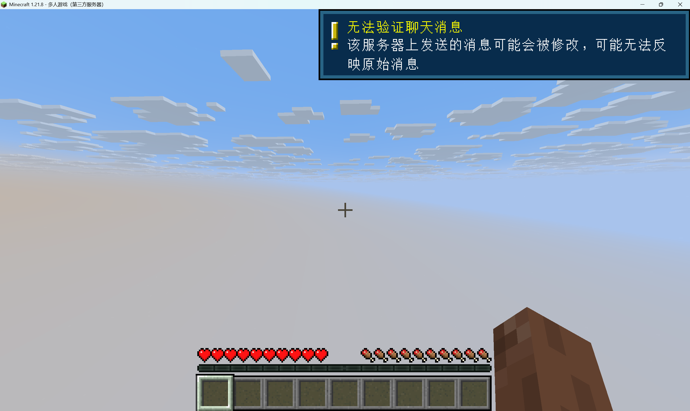

# Qexed
量子存在态 (Quantum Existence State)

一个基于Rust所开发的我的世界服务端。
参考了 FerrumC 等众多项目制作
> 目前版本对应:1.21.8

> 聊天群(QQ):524167891

该项目基于Redis与MongoDB制作,因此使用前需部署MongoDB和Redis服务器

- Redis: 用于缓存区块以及玩家信息
- MongoDB: 存储玩家数据
# 计划
下面根据我的世界java服网络数据包协议的进服顺序安排开发计划
- 登录阶段
    - [ ] Handshake
        - [x] 跳转 Status 阶段
        - [x] 跳转 Login 阶段
        - [ ] 代理支持
    - [x] StatusRequest
        - [x] Ping
        - [ ] 自定义 Ping 头像
    - [ ] Login
        - [ ] Mojang 正版验证
        - [ ] 解压缩
        - [ ] 加解密
        - [x] 离线模式登录
        - [x] 跳转 Configuration 阶段
        - [x] 断开连接数据包
    - [ ] Configuration
        - [x] 收发 Plugin_Message 事件
        - [x] SelectKnownPacks 数据包读写
        - [ ] 自定义材质包支持
        - [ ] 自定义资源包支持
        - [ ] Forge 模组资源包支持
        - [ ] RegistryData 数据包支持
        - [ ] 注册表
        - [ ] forge 支持
        - [ ] geyser 支持
    - [ ] play
        - [ ] MongoDB 支持
        - [ ] Login 
        - [x] 进服

- 游戏阶段
    - [ ] 插件SDK
    - [ ] 权限组
    - [ ] 地图加载与管理
    - [ ] 地形生成
    - [ ] 进服时游戏模式的设置
    - [ ] 地形生成器
    - [ ] 全局HashMap(不是地图)
    - [ ] event_status 
# 插件开发
暂时没写到这里(只要兼容wasm就都可以使用)
兼容性计划如下:
| 编程语言 | 支持情况 |
| --- | --- |
| Rust | [ ] |
| Golang | [ ] |
| Python(原生wasm) | 不做官方支持(性能原因) |
| Python(Apollo) | 不支持 |
| C/C++ | 暂时不做支持(懒,优先支持Rust) |
| lua | 不支持 |

> 注:Apollo 是网易基岩版服务端,其编写的python插件不适用此服务端
> 再者Apollo 开发者相对来说太少了,并且我们还没办法测试是否可用。
> 故不对 Apollo 做适配。
> 注: 基岩版插件丢java版咋可能能运行啊。原理都不一样。没法搞

# Forge模组兼容性
> 注:此部分尚未制作
>
> 在 RegistryData 注册表阶段,

你需要使用工具 sniffcraft 进行抓包,将抓包的文件放置在当前目录(文件名类似 2025-08-12-09-18-40_sclogs.txt)

一定要开 Raw Bytes!!!

然后进服务器,进好后退服就行了。

随后执行如下命令,生成注册表二进制包

<code>./qexed --registrydata 2025-08-12-09-18-40_sclogs.txt</code>

这里的2025-08-12-09-18-40_sclogs.txt是你的文件路径。

执行后本地的data/registrydata 