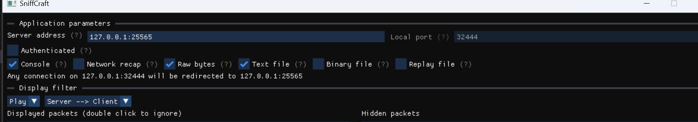

# Qexed
量子存在态 (Quantum Existence State)

一个基于Rust所开发的我的世界服务端。
参考了 FerrumC 等众多项目制作
> 目前版本对应:1.21.8

该项目基于Redis与MongoDB制作,因此使用前需部署MongoDB和Redis服务器

- Redis: 用于缓存区块以及玩家信息
- MongoDB: 存储玩家数据
# 计划
下面根据我的世界java服网络数据包协议的进服顺序安排开发计划
- [ ] Handshake
    - [x] 跳转 Status 阶段
    - [x] 跳转 Login 阶段
    - [ ] 代理支持
- [x] StatusRequest
    - [x] Ping
    - [ ] 自定义 Ping 头像
- [ ] Login
    - [ ] Mojang 正版验证
    - [ ] 解压缩
    - [ ] 加解密
    - [x] 离线模式登录
    - [x] 跳转 Configuration 阶段
    - [x] 断开连接数据包
- [ ] Configuration
    - [x] 收发 Plugin_Message 事件
    - [x] SelectKnownPacks 数据包读写
    - [ ] 自定义材质包支持
    - [ ] 自定义资源包支持
    - [ ] Forge 模组资源包支持
    - [ ] RegistryData 数据包支持
    - [ ] 注册表
    - [ ] forge 支持
    - [ ] geyser 支持
- [] play
# Forge模组兼容性
> 注:此部分尚未制作
>
> 在 RegistryData 注册表阶段,
你需要使用工具 sniffcraft 进行抓包,将抓包的文件放置在当前目录(文件名类似 2025-08-12-09-18-40_sclogs.txt)
一定要开 Raw Bytes!!!

然后进服务器,进好后退服就行了。
随后执行如下命令,生成注册表二进制包
<code>./qexed --registrydata 2025-08-12-09-18-40_sclogs.txt</code>
这里的2025-08-12-09-18-40_sclogs.txt是你的文件路径。
执行后本地的data/registrydata 